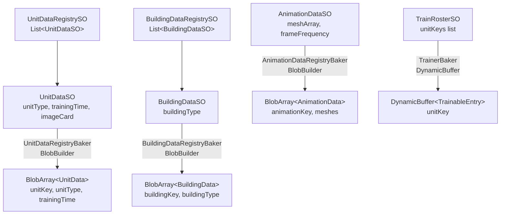

# DOTS RTS Prototype — Game Design Document

> **Version:** 1.0  
> **Engine:** Unity 2022.3+ (DOTS / ECS)  
> **Target Platform:** Android (APK via IL2CPP)  
> **Language Standard:** Oxford English  
> **Generated:** 2026-03-13  

> [!CAUTION]
> **`DOTS_RTS_Prototype/` is READONLY.** This document was derived from analysing the existing codebase without modifying it. All new code is placed in `Vertical_Slice/`.

### Related Documents

| Document | Description |
|----------|-------------|
| [README.md](README.md) | Project overview, badges, and file manifest |
| [BUILD_INSTRUCTIONS.md](Vertical_Slice/BUILD_INSTRUCTIONS.md) | Step-by-step Android APK build guide |
| [Implementation Plan](implementation_plan.md) | Part B deliverables architecture alignment |
| [Walkthrough](walkthrough.md) | Summary of all generated deliverables |

---

## Table of Contents

1. [Executive Summary](#1-executive-summary)  
2. [Gameplay Mechanics](#2-gameplay-mechanics)  
3. [Technical Architecture](#3-technical-architecture)  
4. [UI/UX Design](#4-uiux-design)  
5. [Build & Deployment](#5-build--deployment)  
6. [Appendices](#6-appendices)  

---

## 1. Executive Summary

### 1.1 Vision

**DOTS RTS Prototype** is a high-performance, cartoon-medieval-fantasy Real-Time Strategy / Tower Defence hybrid built entirely on Unity's Data-Oriented Technology Stack (DOTS). The game delivers 3D visuals on a strict 2D gameplay plane (side-scroller perspective with no verticality or relief), targeting Android mobile devices with hundreds of simultaneous entities rendered at a stable 60 FPS.

The visual style is inspired by *Clash of Clans*: vibrant, non-serious, cartoon medieval fantasy. The background consists of a simple grass-textured plane extending across the 2D gameplay area.

### 1.2 Vertical Slice Features

The Vertical Slice milestone encompasses the following playable feature set:

| Feature | Status | Description |
|---------|--------|-------------|
| **Castle Defence** | Core | Player's Castle entity positioned at the far left of the map; game ends if destroyed. |
| **Enemy Wave Spawning** | Core | Hostile units spawn from `Spawner` entities at the far right, advancing linearly toward the Castle. |
| **Farm (Resource Generation)** | Core | `Farm` buildings generate a single currency ("Resources") using an area-based calculation formula. |
| **Barracks (Unit Training)** | Core | `Trainer` buildings recruit friendly troops from a configurable roster with training-time progression. |
| **Melee & Ranged Combat** | Core | Units engage via `MeleeAttack` or `ShootAttack` components; projectiles track targets with overshoot protection. |
| **Unit Selection & Control** | Core | Tap-to-select and box-select via `UnitSelectionManager`; right-click for move or attack commands. |
| **Health & Death** | Core | All combatants and buildings use a shared `Health` component; entities are destroyed at ≤ 0 HP. |
| **Targeting System** | Core | Automatic target acquisition (`TargetFinder`), manual override (`ManualTarget`), and lose-target logic (`LoseTarget`). |
| **Mobile HUD** | Core | Minimalist overlay showing resource count, build buttons, and training queue. |
| **Performance Monitor** | Debug | On-screen FPS, GPU frame-time, CPU/GPU info, and Job thread utilisation via `MobilePerformanceMonitor`. |

### 1.3 Core Loop

```
Build structures (Farms / Barracks)
        │
        ▼
Gather "Resources" (area-based passive income)
        │
        ▼
Recruit troops (queued training with time cost)
        │
        ▼
Defend the Castle ◄── Enemy waves (spawning from the far right)
```

---

## 2. Gameplay Mechanics

### 2.1 Side-Scrolling Logic

All gameplay occurs on a horizontal 2D plane (X–Z in Unity world-space, with Y fixed at ground level). The camera is a fixed or panning orthographic/perspective view that tracks the action from left (Castle) to right (spawn points).

- **No vertical pathfinding** — movement is calculated solely on the XZ plane.
- **Unit movement** is physics-driven via `PhysicsVelocity` linear components (no transform-based movement in production).
- **RandomWalk** behaviour for idle spawned enemies generates random XZ destinations around their spawn origin, clamped between `minDistance` and `maxDistance`.

### 2.2 Resource System — Area-Based Generation

A single global currency called **"Resources"** powers all player actions. Resources are generated passively by **Farm** buildings.

#### 2.2.1 Area-Based Resource Generation Formula

Each Farm calculates its output based on the *available free area* surrounding it. The formula is:

```
R = B × A_free / A_max
```

Where:

| Symbol | Definition |
|--------|-----------|
| `R` | Resources generated per tick (per `ResourceGenerationSystem` update). |
| `B` | Base output rate defined on the `ResourceGenerator` component. |
| `A_free` | Unoccupied area within the Farm's influence radius (calculated via physics overlap sphere). |
| `A_max` | Total influence area (π × radius²). |

The system uses an `OverlapSphere` physics query to detect entities within the Farm's radius. For every collider detected (other buildings or units), the occupied area is estimated from each entity's `colliderOffsetRadius` (already baked on `Unit` and `Building` components). The free-area fraction therefore decreases as more structures or units crowd around a Farm, incentivising the player to space buildings strategically.

### 2.3 Building Systems

#### 2.3.1 Building Types (Existing Enum: `BuildingType`)

| Type | Purpose |
|------|---------|
| `Tower` | Static defensive structure with `ShootAttack`; engages enemies automatically. |
| `Trainer` | Barracks — trains friendly units from a `TrainRosterSO`-defined roster. |
| `Spawner` | Enemy spawn point — periodically instantiates hostile units. |
| `Production` | Farm — generates Resources via area-based calculation. |

#### 2.3.2 Trainer (Barracks) Workflow

1. Player selects a `Trainer` building.
2. The `BuildingTrainerUI` displays the available trainable unit roster (`TrainableEntry` buffer).
3. Player taps a unit card to enqueue a `TrainUnitRequest` (enableable component).
4. The `TrainerSystem` processes the request:
   - Adds the `UnitKey` to the `QueuedUnitBuffer`.
   - Begins a progress timer (`currentProgress` → `maxProgress`, sourced from `UnitData.trainingTime`).
   - Upon completion, instantiates the unit prefab at the `spawnPointOffset`, sets its `UnitMover.targetPosition` to the `rallyPositionOffset`.
5. Queue changes fire the `onUnitQueueChange` event, bridged to managed code via `DOTSEventManager`.

### 2.4 Combat Systems

#### 2.4.1 Melee Attack (`MeleeAttackSystem`)

- Queries entities with: `LocalTransform`, `MeleeAttack`, `Targetter`, `UnitMover`, `Unit` (all with `ManualMove` disabled).
- If a valid target exists:
  - **Out of range**: Sets `UnitMover.targetPosition` to the target's position (chase).
  - **In range**: Stops movement; decrements `attackPhaseTime` each frame; on timer expiry, deals `damageAmount` to target's `Health` and fires `onAttack` event.
- Range calculation accounts for both attacker and target `colliderOffsetRadius` values, avoiding expensive raycasts.

#### 2.4.2 Ranged Attack (`ShootAttackSystem`)

- Two-pass query:
  1. **Moving shooters** (with `UnitMover`): Chase if out of range; rotate toward target and stop when in range.
  2. **All shooters**: If target is in range and entity is not manually moving → decrement timer → on expiry, instantiate a `Projectile` entity from the `EntityPrefabsRegistry`, set its `damageAmount`, `shooterEntity`, and target via `Targetter`.
- `ProjectileMoverSystem` moves projectiles toward the target's `Shootable.hitPointPosition`, applies damage on arrival, and triggers retribution targeting.

#### 2.4.3 Projectile Behaviour

- Straight-line homing toward target's `hitPointPosition`.
- Overshoot protection: if `distanceAfterSquared > distanceBeforeSquared`, teleport to target position.
- On hit: apply damage, set target's own `Targetter` to the `shooterEntity` (retribution), destroy projectile.

### 2.5 Targeting Pipeline

```
ManualTarget (player override)
      │ takes priority
      ▼
TargetFinder (automatic scan via OverlapSphere)
      │ finds closest hostile based on factionID
      ▼
Targetter (shared target reference)
      │
      ├── MeleeAttackSystem reads it
      ├── ShootAttackSystem reads it
      └── UnitMoverSystem follows it
      
LoseTargetSystem
      │ if target distance > thresholdDistance after attemptFrequency, set Targetter.targetEntity = null
      
ResetTargetSystem
      │ at start of LateSimulationSystemGroup, nullify targetEntity if entity no longer exists
```

### 2.6 Faction System

All combatants carry a `Faction` component with a `factionID` (uint):

| Faction ID | Description |
|-----------|-------------|
| `0` | Neutral — never targeted by anyone. |
| `1` | Player faction. |
| `2+` | Enemy factions. |

Targeting rules: An entity only acquires targets whose `factionID` differs from its own, and neither faction is `0`.

### 2.7 Unit Selection & Commands

Handled by the `UnitSelectionManager` MonoBehaviour (managed bridge to ECS):

| Action | Behaviour |
|--------|-----------|
| **Left-click (tap)** | Raycast → select single entity with `Faction` + `Selected` components. |
| **Left-click drag** | Box-select → all entities whose `LocalTransform` screen-projection falls within `selectionAreaRect`. |
| **Right-click on ground** | Set `ManualMove.targetPosition` on all selected units; generate circle formation offsets; clear `ManualTarget`. |
| **Right-click on hostile entity** | Set `ManualTarget.targetEntity` on all selected units (attack command). |
| **Right-click with Trainer selected** | Update `Trainer.rallyPositionOffset`. |

---

## 3. Technical Architecture

### 3.1 Project Structure

```
Assets/
├── Scripts/
│   ├── Authoring/           # MonoBehaviour authoring + Baker + IComponentData structs
│   │   ├── Animation/       # ActiveAnimation, AnimatedMeshReference, AnimationDataRegistry, UnitAnimations
│   │   ├── Attacks/         # MeleeAttack, ShootAttack, Shootable
│   │   ├── Buildings/       # Building, BuildingDataRegistry, BuildingDataSOHolder, Spawner, Trainer
│   │   ├── Common/          # Faction, Health, Selected
│   │   ├── Targeting/       # LoseTarget, ManualTarget, TargetFinder, Targetter
│   │   ├── UI/              # HealthBar
│   │   ├── Units/           # ManualMove, RandomWalk, Unit, UnitDataRegistry, UnitDataSOHolder, UnitMover
│   │   ├── EntityPrefabsRegistryAuthoring.cs
│   │   ├── ProjectileAuthoring.cs
│   │   └── SelfDestroyAuthoring.cs
│   ├── Systems/             # ISystem / partial struct implementations
│   │   ├── Animation/       # ActiveAnimation, AnimationDataRegistryPostBaking, AnimationState, ChangeAnimation
│   │   ├── Attacks/         # MeleeAttack, ShootAttack
│   │   ├── Buildings/       # Spawner, Trainer
│   │   ├── Common/          # Health, SelectedVisual
│   │   ├── Targeting/       # LoseTarget, ResetTarget, TargetFinder
│   │   ├── UI/              # HealthBar
│   │   ├── Units/           # ManualMove, RandomWalk, UnitMover
│   │   ├── OnShootSpawnSystem.cs
│   │   ├── ProjectileMoverSystem.cs
│   │   ├── ResetEventSystem.cs
│   │   ├── SelfDestroySystem.cs
│   │   └── TestingSystem.cs
│   ├── MonoBehaviours/      # Managed singletons and UI bridges
│   │   ├── DOTSEventManager.cs
│   │   ├── GameAssets.cs
│   │   ├── MouseWorldPosition.cs
│   │   ├── UnitSelectionManager.cs
│   │   └── UI/              # BuildingTrainerUI, UnitSelectionManagerUI
│   ├── ScriptableObjects/   # SO class definitions
│   │   ├── AnimationDataRegistrySO.cs / AnimationDataSO.cs
│   │   ├── BuildingDataRegistrySO.cs / BuildingDataSO.cs
│   │   ├── UnitDataRegistrySO.cs / UnitDataSO.cs
│   │   └── TrainRosterSO.cs
│   ├── Util/                # Static utility classes
│   │   ├── EntityUtil.cs
│   │   └── RegistryAccessor.cs
│   ├── Etc/                 # Misc tooling
│   │   └── MobilePerformanceMonitor.cs
│   └── Editor/              # Editor-only tools
│       └── SkinnedMeshBaker.cs
├── ScriptableObjects/       # Serialised SO asset instances
│   ├── AnimationData/
│   ├── Buildings/
│   └── Units/
├── Prefabs/
├── Materials/
├── Meshes/
├── Textures/
└── Scenes/
```

### 3.2 ECS Data Flow

The architecture follows a strict **Authoring → Baker → IComponentData → ISystem** pipeline:

```mermaid
graph LR
    A["ScriptableObject<br/>(UnitDataSO, BuildingDataSO)"] -->|"defines data"| B["MonoBehaviour Authoring<br/>(UnitAuthoring, BuildingAuthoring)"]
    B -->|"Baker.Bake()"| C["IComponentData Structs<br/>(Unit, Building, Health...)"]
    C -->|"SystemAPI.Query"| D["ISystem Structs<br/>(UnitMoverSystem, MeleeAttackSystem...)"]
    D -->|"Burst + Job System"| E["Parallel Execution<br/>(IJobEntity)"]
    E -->|"ECB structural changes"| F["EndSimulationEntityCommandBufferSystem"]
```



### 3.3 IComponentData Definitions

#### 3.3.1 Core Entity Tags & Components

| Component | Type | Fields | Purpose |
|-----------|------|--------|---------|
| `Unit` | `IComponentData` | `ownerID: int`, `colliderOffsetRadius: float` | Marks an entity as a unit; stores collider radius for distance calculations. |
| `Building` | `IComponentData` | `ownerID: int`, `colliderOffsetRadius: float` | Marks an entity as a building. |
| `Faction` | `IComponentData` | `factionID: uint` | Ownership/team identification for targeting logic. |
| `Health` | `IComponentData` | `currentHealth: int`, `maxHealth: int`, `onHealthChanged: bool` | Hit points with event flag for UI updates. |
| `Selected` | `IComponentData, IEnableableComponent` | `selectedGizmoEntity: Entity`, `displayScale: float`, `onSelected: bool`, `onDeselected: bool` | Enableable selection state with visual gizmo reference. |

#### 3.3.2 Movement Components

| Component | Type | Fields | Purpose |
|-----------|------|--------|---------|
| `UnitMover` | `IComponentData` | `moveSpeed: float`, `rotationSpeed: float`, `targetReachedDistanceSquared: float`, `targetPosition: float3`, `isMoving: bool` | Physics-driven movement toward a target position. |
| `ManualMove` | `IComponentData, IEnableableComponent` | `targetPosition: float3` | Player-commanded movement override (disabled by default). |
| `RandomWalk` | `IComponentData` | `targetPosition: float3`, `originPointPosition: float3`, `minDistance: float`, `maxDistance: float`, `random: Random` | Idle wandering behaviour with deterministic RNG. |

#### 3.3.3 Targeting Components

| Component | Type | Fields | Purpose |
|-----------|------|--------|---------|
| `Targetter` | `IComponentData` | `targetEntity: Entity` | Current target entity reference. |
| `ManualTarget` | `IComponentData` | `targetEntity: Entity` | Player-commanded target override. |
| `TargetFinder` | `IComponentData` | `scanPhaseTime: float`, `scanFrequency: float`, `targetRange: float`, `swapTargetMinDistance: float` | Automatic target acquisition via `OverlapSphere`. |
| `LoseTarget` | `IComponentData` | `thresholdDistance: float`, `attemptPhaseTime: float`, `attemptFrequency: float` | Automatic target release when distance exceeds threshold. |

#### 3.3.4 Attack & Projectile Components

| Component | Type | Fields | Purpose |
|-----------|------|--------|---------|
| `MeleeAttack` | `IComponentData` | `attackPhaseTime`, `attackFrequency`, `attackDistance`, `damageAmount: int`, `onAttack: bool` | Melee damage with cooldown timer and event. |
| `ShootAttack` | `IComponentData` | `projectilePrefabKey`, `attackPhaseTime`, `attackFrequency`, `attackDistance`, `damageAmount`, `projectileSpawnPointLocalPosition: float3`, `onShoot: OnShootEvent` | Ranged damage via projectile instantiation. |
| `Shootable` | `IComponentData` | `hitPointPosition: float3` | Defines the exact hit-point position for incoming projectiles. |
| `Projectile` | `IComponentData` | `speed: float`, `damageAmount: int`, `shooterEntity: Entity` | Homing projectile data. |

#### 3.3.5 Building Components

| Component | Type | Fields | Purpose |
|-----------|------|--------|---------|
| `Spawner` | `IComponentData` | `spawnedEntityKey`, `spawnPhaseTime`, `spawnFrequency`, `minDistance`, `maxDistance`, `nearbyEntityCap`, `nearbyEntityScanRadius` | Enemy spawner with cap logic via `OverlapSphere`. |
| `Trainer` | `IComponentData` | `currentProgress`, `maxProgress`, `activeUnitKey`, `spawnPointOffset`, `rallyPositionOffset`, `onUnitQueueChange` | Barracks training with queue management. |
| `TrainUnitRequest` | `IComponentData, IEnableableComponent` | `unitKey: UnitKey` | One-shot enableable request to enqueue a unit. |
| `QueuedUnitBuffer` | `IBufferElementData` | `unitKey: UnitKey` | Training queue entries. |
| `TrainableEntry` | `IBufferElementData` | `unitKey: UnitKey` | Available units in the trainer's roster. |
| `ResourceGenerator` | `IComponentData` | `baseOutputRate`, `influenceRadius`, `accumulatedResources`, `generationPhaseTime`, `generationFrequency` | **[NEW]** Farm resource generation. |

#### 3.3.6 Vertical Slice Components (NEW)

| Component | Type | Fields | Purpose |
|-----------|------|--------|---------|
| `CastleTag` | `IComponentData` | *(zero-size tag)* | **[NEW]** Identifies the player's Castle entity. |
| `EnemyTag` | `IComponentData` | *(zero-size tag)* | **[NEW]** Identifies an enemy-wave unit. |
| `ResourceGenerator` | `IComponentData` | See §3.3.5 above | **[NEW]** Area-based resource generation. |
| `PlayerResources` | `IComponentData` (Singleton) | `currentResources: float` | **[NEW]** Global resource pool; deposited into by `ResourceGenerationSystem`. |

#### 3.3.7 Registry & Prefab Infrastructure

| Component / Buffer | Type | Fields | Purpose |
|-----------|------|--------|---------|
| `EntityPrefabsRegistry` | `IComponentData` (Singleton) | `shootLightPrefabEntity: Entity` | Singleton container for global prefab references. |
| `EntityReference` | `IBufferElementData` | `entityRefKey: EntityReferenceKey`, `prefabEntity: Entity` | Sorted buffer of name-keyed prefab entities; supports binary search. |
| `EntityReferenceKey` | `struct` | `name: FixedString64Bytes` | Blittable key struct implementing `IEquatable`, `IComparable`. |
| `UnitDataRegistry` | `IComponentData` (Singleton) | `unitBlobArrayReference: BlobAssetReference<BlobArray<UnitData>>` | Blob-backed sorted array of all `UnitData` entries. |
| `BuildingDataRegistry` | `IComponentData` (Singleton) | `buildingBlobArrayReference: BlobAssetReference<BlobArray<BuildingData>>` | Blob-backed sorted array of all `BuildingData` entries. |

### 3.4 ISystem / SystemBase Logic

All systems are implemented as `partial struct : ISystem` with `[BurstCompile]` where possible. The system update order follows Unity DOTS defaults unless explicitly overridden:

| System | Group | Burst | Job | Description |
|--------|-------|-------|-----|-------------|
| `UnitMoverSystem` | Default | ✅ | `UnitMoverJob : IJobEntity` | Physics-velocity movement + rotation interpolation. |
| `ManualMoveSystem` | Default | ✅ | — | Overrides `UnitMover.targetPosition` from `ManualMove`. |
| `RandomWalkSystem` | Default | ✅ | — | Generates random destinations for idle entities. |
| `FindTargetSystem` | Default | ✅ | — | `OverlapSphere` scan to acquire closest hostile target. |
| `LoseTargetSystem` | Default | ✅ | — | Releases targets that move beyond threshold distance. |
| `MeleeAttackSystem` | Default | ✅ | — | Chase/stop/damage loop for melee entities. |
| `ShootAttackSystem` | Default | ✅ | — | Chase/stop/spawn-projectile loop for ranged entities. |
| `ProjectileMoverSystem` | Default | ✅ | — | Homing projectile movement + damage-on-hit. |
| `SpawnerSystem` | Default | ✅ | — | Enemy spawn with nearby-cap logic. |
| `TrainerSystem` | Default | ✅ | — | Unit training queue processing. |
| `HealthSystem` | Default | ✅ | — | Destroy entities at ≤ 0 HP via ECB. |
| `ResourceGenerationSystem` | Default | ✅ | — | **[NEW]** Area-based resource calculation for Farms. |
| `WaveMovementSystem` | Default | ✅ | `WaveMovementJob : IJobEntity` | **[NEW]** Linear side-scrolling movement for `EnemyTag` entities toward Castle. |
| `SimpleCombatSystem` | Default | ✅ | — | **[NEW]** Proximity-based Castle collision damage with cooldown. |
| `SelectedVisualSystem` | Default | — | — | Toggles selection gizmo visibility. |
| `HealthBarSystem` | Default | — | — | Updates health bar UI per entity. |
| `OnShootSpawnSystem` | Default | — | — | Spawns muzzle-flash entity on shoot event. |
| `ResetTargetSystem` | `LateSimulationSystemGroup` (OrderFirst) | ✅ | `ResetTargetterJob`, `ResetManualTargetJob` | Nullifies dangling entity references. |
| `ResetEventSystem` | `LateSimulationSystemGroup` (OrderLast) | ✅ | Multiple `IJobEntity` | Resets all one-frame event booleans. |
| `SelfDestroySystem` | Default | — | — | Timer-based entity self-destruction. |

### 3.5 ScriptableObject → Entity Data Mapping



All Blob arrays are sorted at bake time (`OrderBy` on key) to enable O(log n) binary search via `RegistryAccessor` at runtime. This avoids `Dictionary` allocations in unmanaged ECS contexts.

### 3.6 Utility Infrastructure

#### `EntityUtil` (Static, Burst-Compatible)

- `ExistsAndPersists(ref SystemState, in Entity)` — validates entity existence *and* checks for pending destruction (via `HasComponent<LocalTransform>`).
- `GetCollisionWorld(this EntityManager)` — convenience extension for physics queries.

#### `RegistryAccessor` (Static, Burst-Compatible)

Provides binary-search accessors for all registry types:
- `GetAnimationData` / `GetBuildingData` / `GetUnitData` — returns `ref` to blob entry.
- `GetEntityReferenceIndex` / `TryGetEntityReferenceIndex` — index lookup in `DynamicBuffer<EntityReference>`.
- `GetPrefabEntity` / `TryGetPrefabEntity` — direct prefab entity retrieval.

### 3.7 Event System

One-frame event booleans are used throughout instead of C# events (which would break Burst):

| Event Flag | Component | Reset By |
|------------|-----------|----------|
| `onHealthChanged` | `Health` | `ResetHealthEventsJob` |
| `onAttack` | `MeleeAttack` | `ResetMeleeAttackEventsJob` |
| `onShoot.isTriggered` | `ShootAttack` | `ResetShootAttackEventsJob` |
| `onSelected` / `onDeselected` | `Selected` | `ResetSelectedEventsJob` |
| `onUnitQueueChange` | `Trainer` | `ResetTrainerEventsJob` → `DOTSEventManager` (bridged to managed) |

All resets occur in `ResetEventSystem` at `LateSimulationSystemGroup, OrderLast`.

### 3.8 Physics Layer Configuration

| Layer Index | Name | Used By |
|-------------|------|---------|
| `6` | Units | All `Unit` entities – used in collision filters for `OverlapSphere` queries. |
| `7` | Buildings | All `Building` entities – used in collision filters for selection and targeting. |

Defined as constants in `GameAssets.UNITS_LAYER` and `GameAssets.BUILDINGS_LAYER`.

---

## 4. UI/UX Design

### 4.1 Mobile HUD Layout

The HUD is designed for one-thumb operation on mobile:

```
┌─────────────────────────────────────────────────┐
│  [⚙]                              Resources: 500│  ← Top bar
│                                                  │
│                                                  │
│           ◄◄◄  GAMEPLAY AREA  ►►►               │
│                                                  │
│                                                  │
│  [🏰 Castle HP: ████████░░]                      │  ← Castle health (always visible)
│                                                  │
│  ┌──────────┐ ┌──────────┐                      │
│  │  🌾 Farm  │ │ ⚔ Barracks│                     │  ← Build buttons (bottom-left)
│  │  50 Res  │ │  80 Res  │                      │
│  └──────────┘ └──────────┘                      │
│                                                  │
│         ┌──────────────────────┐                │
│         │ Training Queue:      │                │  ← Trainer panel (contextual)
│         │ [Soldier] [Archer]   │                │
│         │ Progress: ████░░ 60% │                │
│         └──────────────────────┘                │
└─────────────────────────────────────────────────┘
```

### 4.2 Interaction Model

| Gesture | Action |
|---------|--------|
| **Single tap** on unit/building | Select entity; display info panel. |
| **Drag** across screen | Box-select multiple units. |
| **Tap** on ground (with units selected) | Move selected units to position in circle formation. |
| **Tap** on hostile entity (with units selected) | Attack-move selected units toward target. |
| **Tap** build button | Place building at predefined plot. |
| **Tap** unit card on Trainer panel | Enqueue unit for training. |

### 4.3 Health Bars

Each entity with a `Health` component displays a world-space health bar managed by the `HealthBarSystem`. Bars are positioned above the entity, scaled proportionally to `currentHealth / maxHealth`, and only updated when `onHealthChanged` fires.

### 4.4 Selection Feedback

Selected entities display a circular gizmo beneath them (`Selected.selectedGizmoEntity`), scaled to `Selected.displayScale`. The `SelectedVisualSystem` toggles visibility based on the `Selected` enableable component.

---

## 5. Build & Deployment

### 5.1 Android Build Instructions

1. **Unity Editor Setup:**
   - Open the project in Unity 2022.3+.
   - Ensure the following packages are installed via Package Manager:
     - `com.unity.entities` (1.0+)
     - `com.unity.physics`
     - `com.unity.rendering.hybrid`
     - `com.unity.burst`
     - `com.unity.collections`

2. **Player Settings** (`Edit → Project Settings → Player`):
   - **Scripting Backend:** IL2CPP
   - **Target Architectures:** ARM64
   - **API Compatibility Level:** .NET Standard 2.1
   - **Managed Stripping Level:** High (for APK size reduction)

3. **Burst Settings** (`Jobs → Burst → Burst Inspector`):
   - Enable Burst Compilation: ✅
   - Safety Checks: Disabled (Release) / Enabled (Debug)
   - Optimisation Level: Level 2 (LLVM -O2)

4. **Build** (`File → Build Settings`):
   - Platform: Android
   - Texture Compression: ASTC (recommended for modern Android)
   - Build System: Gradle
   - Export: APK
   - Run Device: Connected Android device via USB debugging.

5. **Performance Validation:**
   - Use `MobilePerformanceMonitor` (attach to any scene GameObject) to verify:
     - FPS ≥ 60 sustained
     - GPU Frame Time < 16.6 ms
     - Job thread utilisation at maximum worker count

---

## 6. Appendices

### Appendix A: Complete IComponentData Quick Reference

| Struct | File | Category |
|--------|------|----------|
| `Unit` | `UnitAuthoring.cs` | Units |
| `UnitMover` | `UnitMoverAuthoring.cs` | Units |
| `ManualMove` | `ManualMoveAuthoring.cs` | Units |
| `RandomWalk` | `RandomWalkAuthoring.cs` | Units |
| `Building` | `BuildingAuthoring.cs` | Buildings |
| `Spawner` | `SpawnerAuthoring.cs` | Buildings |
| `Trainer` | `TrainerAuthoring.cs` | Buildings |
| `TrainUnitRequest` | `TrainerAuthoring.cs` | Buildings |
| `Health` | `HealthAuthoring.cs` | Common |
| `Faction` | `FactionAuthoring.cs` | Common |
| `Selected` | `SelectedAuthoring.cs` | Common |
| `Targetter` | `TargetterAuthoring.cs` | Targeting |
| `ManualTarget` | `ManualTargetAuthoring.cs` | Targeting |
| `TargetFinder` | `TargetFinderAuthoring.cs` | Targeting |
| `LoseTarget` | `LoseTargetAuthoring.cs` | Targeting |
| `MeleeAttack` | `MeleeAttackAuthoring.cs` | Attacks |
| `ShootAttack` | `ShootAttackAuthoring.cs` | Attacks |
| `Shootable` | `ShootableAuthoring.cs` | Attacks |
| `Projectile` | `ProjectileAuthoring.cs` | Attacks |
| `EntityPrefabsRegistry` | `EntityPrefabsRegistryAuthoring.cs` | Registry |
| `EntityReference` | `EntityPrefabsRegistryAuthoring.cs` | Registry |
| `UnitDataRegistry` | `UnitDataRegistryAuthoring.cs` | Registry |
| `BuildingDataRegistry` | `BuildingDataRegistryAuthoring.cs` | Registry |
| `BuildingDataSOHolder` | `BuildingDataSOHolderAuthoring.cs` | Registry |
| `CastleTag` | `CastleTagAuthoring.cs` | **[NEW]** Vertical Slice |
| `EnemyTag` | `EnemyTagAuthoring.cs` | **[NEW]** Vertical Slice |
| `ResourceGenerator` | `ResourceGeneratorAuthoring.cs` | **[NEW]** Vertical Slice |
| `PlayerResources` | `PlayerResourcesAuthoring.cs` | **[NEW]** Vertical Slice |

### Appendix B: System Execution Order

```
SimulationSystemGroup (default)
├── FindTargetSystem
├── LoseTargetSystem
├── ManualMoveSystem
├── RandomWalkSystem
├── UnitMoverSystem
├── MeleeAttackSystem
├── ShootAttackSystem
├── ProjectileMoverSystem
├── SpawnerSystem
├── TrainerSystem
├── ResourceGenerationSystem  [NEW]
├── WaveMovementSystem         [NEW]
├── SimpleCombatSystem          [NEW]
├── HealthSystem
├── HealthBarSystem
├── SelectedVisualSystem
├── OnShootSpawnSystem
├── SelfDestroySystem
└── ...

LateSimulationSystemGroup
├── ResetTargetSystem          (OrderFirst)
└── ResetEventSystem           (OrderLast)
```

### Appendix C: Glossary

| Term | Definition |
|------|-----------|
| **Authoring** | A `MonoBehaviour` placed on a GameObject in the editor scene, defining managed data for the baker. |
| **Baker** | A `Baker<T>` class that converts authoring data into unmanaged `IComponentData` at bake time. |
| **Blob Asset** | Immutable, read-only data stored in unmanaged memory, accessible from Burst-compiled code. |
| **ECB** | Entity Command Buffer — defers structural changes (create/destroy/add/remove) to avoid race conditions. |
| **Enableable Component** | An `IEnableableComponent` that can be toggled on/off without structural changes. |
| **Event-Bool** | A boolean flag on a component that is set to `true` for one frame, then reset by `ResetEventSystem`. |

---

*Document generated 2026-03-13 based on the DOTS RTS Prototype codebase analysis.*  
*Oxford English standard applied throughout.*  
*`DOTS_RTS_Prototype/` directory: READONLY — no modifications made.*
