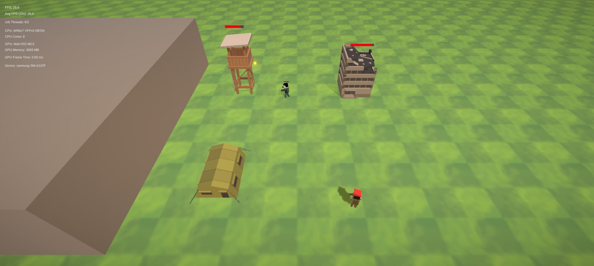
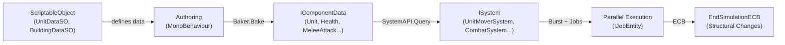

# DOTS RTS Prototype


> **Genre:** 3D RTS / Tower Defence Hybrid (Side-Scroller)  
> **Visual Style:** Cartoon Medieval Fantasy (Clash of Clans style)  
> **Perspective:** 3D graphics on a 2D gameplay plane (no verticality)  
> **Language Standard:** Oxford English  
> **Last Updated:** 2026-03-13  

---

## 🔒 Readonly Policy

> [!CAUTION]
> **The `DOTS_RTS_Prototype/` directory is READONLY.** It contains the original Unity project source code and must not be modified by any AI assistant or automated tool. It serves as the reference codebase for all generated deliverables.
>
> All new code and documentation is generated in the project root (`DOTS-TFC-main/`) or in the `Vertical_Slice/` directory.

---

## 📖 Overview

**DOTS RTS Prototype** is a high-performance Real-Time Strategy / Tower Defence hybrid built entirely on Unity's **Data-Oriented Technology Stack** (DOTS). It delivers 3D cartoon-medieval visuals on a strict 2D gameplay plane, targeting Android mobile devices with hundreds of simultaneous entities at 60 FPS.

### Core Loop

```
🏗️ Build structures (Farms / Barracks)
        │
        ▼
💰 Gather "Resources" (area-based passive income)
        │
        ▼
⚔️ Recruit troops (queued training with time cost)
        │
        ▼
🏰 Defend the Castle ◄── Enemy waves (spawning from the far right)
```

---

## 📸 Screenshot



---

## 🏗️ Project Structure

```
DOTS_RTS_Prototype/
└── Assets/
    └── Scripts/
        ├── Authoring/          # MonoBehaviour + Baker + IComponentData
        │   ├── Animation/      # Mesh-based sprite animation system
        │   ├── Attacks/        # MeleeAttack, ShootAttack, Shootable
        │   ├── Buildings/      # Building, Spawner, Trainer, Registries
        │   ├── Common/         # Faction, Health, Selected
        │   ├── Targeting/      # Targetter, TargetFinder, LoseTarget
        │   ├── UI/             # HealthBar
        │   └── Units/          # Unit, UnitMover, ManualMove, RandomWalk
        ├── Systems/            # ISystem implementations (Burst-compiled)
        │   ├── Animation/      # Frame-based mesh animation playback
        │   ├── Attacks/        # Melee & ranged combat loops
        │   ├── Buildings/      # Spawner (enemy waves) & Trainer (unit production)
        │   ├── Common/         # Health (death), SelectedVisual
        │   ├── Targeting/      # Auto-target, lose-target, reset-target
        │   └── Units/          # Movement, random walk, manual move
        ├── MonoBehaviours/     # Managed singletons & UI bridges
        ├── ScriptableObjects/  # SO class definitions
        ├── Util/               # EntityUtil, RegistryAccessor
        └── Etc/                # MobilePerformanceMonitor

Vertical_Slice/                 # [NEW] Compilable Code Blueprint
├── EntityDefinitions/
│   ├── CastleTagAuthoring.cs           # Castle identification tag
│   ├── EnemyTagAuthoring.cs            # Enemy wave unit tag
│   ├── ResourceGeneratorAuthoring.cs   # Area-based Farm generation
│   └── PlayerResourcesAuthoring.cs     # Global resource pool singleton
├── Systems/
│   ├── ResourceGenerationSystem.cs     # Burst: area-based resource calculation
│   ├── WaveMovementSystem.cs           # Burst: linear side-scrolling + IJobEntity
│   └── SimpleCombatSystem.cs           # Burst: collision/damage logic
└── BUILD_INSTRUCTIONS.md              # Android APK build guide
```

---

## 🎮 Features

### Implemented ✅

| Feature | Description |
|---------|-------------|
| **Castle Defence** | Player's Castle at the far left; game-over if destroyed |
| **Enemy Wave Spawning** | `Spawner` entities generate hostiles from the right |
| **Unit Training (Barracks)** | `Trainer` buildings with queued production and roster |
| **Melee Combat** | Distance-based attack with collider-aware range |
| **Ranged Combat** | Projectile instantiation with homing & overshoot protection |
| **Target Acquisition** | Auto-targeting via `OverlapSphere`, manual override, lose-target |
| **Unit Selection** | Tap-to-select, box-select, circle formation movement |
| **Health & Death** | Shared `Health` component; entity destruction at ≤ 0 HP |
| **Mesh Animation** | Frame-based mesh-swap animation via BlobArrays |
| **Performance Monitor** | FPS, GPU frame time, CPU/GPU info, job thread count |

### Vertical Slice (New) 🆕

| Feature | Description |
|---------|-------------|
| **`CastleTag`** | Zero-size tag component to identify the Castle entity |
| **`EnemyTag`** | Zero-size tag for enemy wave units |
| **`ResourceGenerator`** | Area-based Farm income: `R = B × (A_free / A_max)` |
| **`PlayerResources`** | Global singleton for the player's resource balance |
| **`ResourceGenerationSystem`** | Burst-compiled area scan using `OverlapSphere` |
| **`WaveMovementSystem`** | Burst `IJobEntity` for linear Castle-directed movement |
| **`SimpleCombatSystem`** | Proximity-based Castle damage with cooldown timers |

---

## 🛠️ Technical Stack

| Technology | Usage |
|-----------|-------|
|  | Entity Component System (DOTS) |
|  | LLVM-based AOT/JIT compilation for hot paths |
|  | `IJobEntity` for multi-threaded entity processing |
|  | `OverlapSphere`, `RayCast`, `PhysicsVelocity` |
|  | Ahead-of-time compilation for Android |
|  | Sorted arrays with O(log n) binary search |

---

## 📋 Documentation

| Document | Description |
|----------|-------------|
| [Game Design Document](Game_Design_Document.md) | Full GDD: mechanics, ECS architecture, 25+ IComponentData definitions, 17+ ISystem catalogue |
| [Build Instructions](Vertical_Slice/BUILD_INSTRUCTIONS.md) | Android APK compilation with Burst + IL2CPP optimisation settings |
| [Implementation Plan](implementation_plan.md) | Part B deliverables plan, architecture alignment, and design decisions |
| [Walkthrough](walkthrough.md) | Summary of all generated deliverables with file links |
| [Task Checklist](task.md) | Prompt.txt deliverables tracking (Part A + Part B) |
| [Prompt.txt](Prompt.txt) | Original generation prompt — defines scope and restrictions |

---

## 🚀 Requirements

### Unity & Packages

| Requirement | Version |
|-------------|---------|
| Unity Editor | **2022.3 LTS+** (tested on Unity 6000.3) |
| `com.unity.entities` | 1.0+ |
| `com.unity.entities.graphics` | 1.0+ |
| `com.unity.burst` | 1.8+ |
| `com.unity.physics` | 1.0+ |
| `com.unity.collections` | 2.1+ |
| `com.unity.render-pipelines.universal` | 14.0+ |
| `com.unity.inputsystem` | 1.5+ |
| .NET | Standard 2.1 |

### IDE

- **Visual Studio 2019+** or **Visual Studio Code** with the Unity extension
- Open the solution: `DOTS_RTS_Prototype/DOTS_RTS_Prototype.slnx`

---

## 📂 Opening the Project

1. Open the project in Unity Editor (2022.3+).
2. On first load, expect transient exceptions during compilation — this is normal DOTS behaviour.
3. Ensure all packages are installed: **Window → Package Manager**.
4. Testing scene: `Assets/Scenes/MainTestScene.unity`.

To open in your IDE:
1. **Edit → Preferences → External Tools → External Script Editor** — select your IDE.
2. **Assets → Open C# Project**.

---

## 🔧 Troubleshooting

| Issue | Solution |
|-------|----------|
| **Compilation errors** | Update all packages in Package Manager; clear `Library/` folder and reimport |
| **IDE doesn't recognise Unity types** | Ensure the project has been run once after opening; regenerate project files |
| **VS Code slow IntelliSense** | Open `DOTS_RTS_Prototype.slnx`; wait 2–4 minutes for OmniSharp |
| **Burst compilation failures** | Verify IL2CPP backend is selected; check Burst package compatibility |
| **Low FPS on Android** | Reduce Shadow Resolution; check entity count with Profiler |

---

## ⚠️ Disclaimer

This project is a **work-in-progress academic prototype**. Graphical assets are placeholders from [Synty Studios](https://assetstore.unity.com/publishers/5217) free collections. Features may be refactored, replaced, or removed.

---

## 📊 ECS Architecture Overview



---

## 📄 File Manifest

All generated files outside of the readonly `DOTS_RTS_Prototype/` directory:

| File | Type | Description |
|------|------|-------------|
| `Game_Design_Document.md` | 📘 Part A | Comprehensive Game Design Document |
| `Vertical_Slice/EntityDefinitions/CastleTagAuthoring.cs` | 🏷️ Part B | Castle identification tag component |
| `Vertical_Slice/EntityDefinitions/EnemyTagAuthoring.cs` | 🏷️ Part B | Enemy wave unit tag component |
| `Vertical_Slice/EntityDefinitions/ResourceGeneratorAuthoring.cs` | ⚙️ Part B | Area-based Farm resource generation component |
| `Vertical_Slice/EntityDefinitions/PlayerResourcesAuthoring.cs` | ⚙️ Part B | Global resource pool singleton component |
| `Vertical_Slice/Systems/ResourceGenerationSystem.cs` | 🔧 Part B | Burst: area-based `OverlapSphere` resource system |
| `Vertical_Slice/Systems/WaveMovementSystem.cs` | 🔧 Part B | Burst: `IJobEntity` linear Castle-directed movement |
| `Vertical_Slice/Systems/SimpleCombatSystem.cs` | 🔧 Part B | Burst: proximity-based Castle collision damage |
| `Vertical_Slice/BUILD_INSTRUCTIONS.md` | 📄 Part B | Android APK build guide |
| `implementation_plan.md` | 📋 Meta | Architecture alignment and design decisions |
| `walkthrough.md` | 📋 Meta | Deliverables summary with file links |
| `task.md` | 📋 Meta | Generation task checklist |

---

> **Repository:** [DOTS-TFC](https://github.com/auslamg/DOTS-TFC) (collaborator access required)  
> **Generated:** 2026-03-13 — All deliverables produced per `Prompt.txt` specifications.