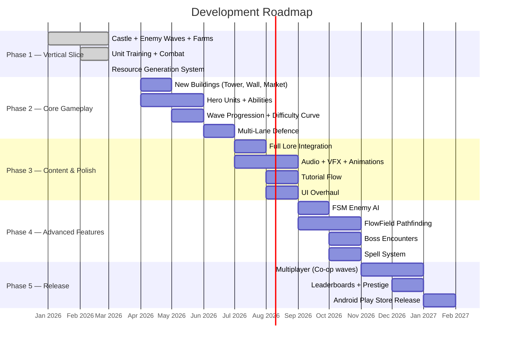
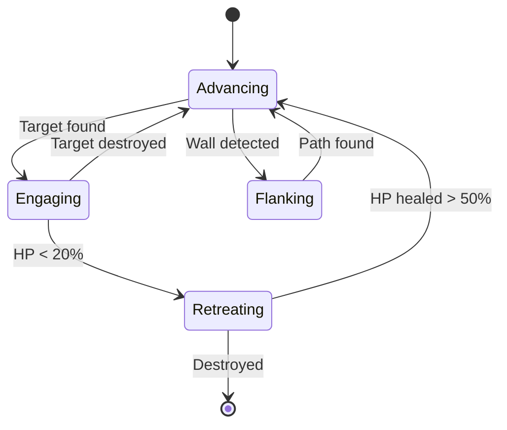

# DOTS RTS Prototype — Roadmap

> **Generated:** 2026-03-13  
> **Language Standard:** Oxford English  
> **`DOTS_RTS_Prototype/`:** READONLY — context only, no modifications  

### Related Documents

| Document | Description |
|----------|-------------|
| [README.md](README.md) | Project overview, badges, and file manifest |
| [Game Design Document](Game_Design_Document.md) | Current GDD with ECS architecture |
| [Implementation Plan](implementation_plan.md) | Vertical Slice deliverables |
| [Walkthrough](walkthrough.md) | Summary of generated deliverables |

---

## Table of Contents

1. [Lore & World-Building](#1-lore--world-building)
2. [Milestone Phases](#2-milestone-phases)
3. [New Buildings](#3-new-buildings)
4. [New Units](#4-new-units)
5. [New Systems & Mechanics](#5-new-systems--mechanics)
6. [AI & Pathfinding](#6-ai--pathfinding)
7. [UI/UX Enhancements](#7-uiux-enhancements)
8. [Audio & Visual Polish](#8-audio--visual-polish)
9. [Multiplayer & Social](#9-multiplayer--social)
10. [Performance & Platform](#10-performance--platform)
11. [Quality of Life](#11-quality-of-life)
12. [Known Issues & Technical Debt](#12-known-issues--technical-debt)

---

## 1. Lore & World-Building

### 1.1 The Setting — *The Shattered Kingdoms*

In an age long forgotten, the Realm of **Aurelheim** thrived under the banner of the **Golden Crown** — a confederacy of five kingdoms bound by an ancient pact. For centuries, peace was maintained by the *Covenant of the Sunstone*, a mythical artefact of immense power embedded deep within the Castle of **Thornhollow**.

But the pact shattered when the **Warlord Malachar**, an exiled sorcerer-king from the eastern wastes of **Grimvelde**, discovered the location of the Sunstone. With his army of Orcs, Goblins, and cursed war-beasts, Malachar launched a relentless campaign to seize the artefact and bend it to his will.

Now, the last bastion of Aurelheim stands at the edge of the known world — the fortress of **Thornhollow**. The player takes the role of the **Castellan**, the appointed commander of Thornhollow's defences. With dwindling resources and a growing horde at the gates, the Castellan must build, recruit, and defend against wave after wave of Malachar's forces.

### 1.2 Factions

| Faction | Colour | Lore | Architecture Style |
|---------|--------|------|-------------------|
| **Thornhollow Alliance** (Player) | 🔵 Blue / Gold | The last loyalists of the Golden Crown. Disciplined soldiers, skilled archers, and resourceful farmers. | Stone keeps, wooden palisades, thatched roofs with blue banners. |
| **Grimvelde Horde** (Enemy Wave 1) | 🔴 Red / Black | Malachar's main army — Orcs and Goblins driven by conquest. Favour brute force. | Dark iron, bone totems, spiked barricades. |
| **Hollow Cult** (Enemy Wave 2) | 🟣 Purple / Grey | Undead cultists summoned by Malachar's dark magic. Slow but relentless. | Ruined stone, spectral glowing accents. |
| **Wild Marauders** (Enemy Wave 3) | 🟢 Green / Brown | Rogue mercenaries and bandits exploiting the chaos. Fast and evasive. | Makeshift tents, stolen armour, no formation. |
| **Neutral Traders** | ⚪ White / Gold | Wandering merchants who sell rare upgrades at the market. Cannot be attacked. | Ornate caravans with colourful awnings. |

### 1.3 Timeline (Campaign Narrative)

| Act | Name | Theme | Waves | New Mechanic Unlocked |
|-----|------|-------|-------|----------------------|
| **I** | *The First Siege* | Tutorial + Core loop | 1–5 | Farm, Barracks, basic melee units |
| **II** | *Shadows Rising* | Escalation | 6–12 | Tower, ranged units, hero units |
| **III** | *The Dark Covenant* | Undead + multi-lane | 13–20 | Market, walls, multi-lane defence |
| **IV** | *Blood & Iron* | Boss waves + mercenaries | 21–30 | Siege workshop, spell tower, upgrades |
| **V** | *The Final Stand* | Endless survival | 31+ | Prestige resets, leaderboards |

### 1.4 Key Characters

| Character | Role | Description |
|-----------|------|-------------|
| **Castellan Aldric** | Player avatar | A seasoned commander with a tactical mind. Voice-over narration between waves. |
| **Master Builder Helga** | Building advisor | Dwarven engineer who provides building tutorial hints and upgrade suggestions. |
| **Captain Rowan** | Military advisor | Veteran captain who introduces new units and formation strategies. |
| **Warlord Malachar** | Main antagonist | Appears as a boss entity in Act IV. Summons support units and has phase-based attacks. |
| **The Merchant of Winds** | Neutral NPC | Appears between waves at the Market building. Sells random rare items. |

---

## 2. Milestone Phases



### Phase Summary

| Phase | Target | Status | Key Deliverables |
|-------|--------|--------|-----------------|
| **1 — Vertical Slice** | 2026 Q1 | ✅ Done | Castle, Farms, Barracks, combat, resource generation, wave spawning |
| **2 — Core Gameplay** | 2026 Q2 | 🔲 Planned | New buildings, hero units, wave progression, multi-lane |
| **3 — Content & Polish** | 2026 Q3 | 🔲 Planned | Lore, audio, VFX, tutorial, UI overhaul |
| **4 — Advanced Features** | 2026 Q4 | 🔲 Planned | FSM AI, FlowField, boss encounters, spells |
| **5 — Release** | 2027 Q1 | 🔲 Planned | Multiplayer, leaderboards, Play Store release |

---

## 3. New Buildings

### 3.1 Building Registry — Complete Inventory

| Building | Type | Cost | Phase | ECS Components | Description |
|----------|------|------|-------|----------------|-------------|
| **Castle** | Defence | — | 1 | `CastleTag`, `Health`, `Building` | Player's primary objective. Indestructible until Act III. |
| **Farm** | Production | 50 | 1 | `ResourceGenerator`, `Building` | Area-based passive income. |
| **Barracks** | Trainer | 80 | 1 | `Trainer`, `Building`, `TrainableEntry` | Trains melee and basic ranged units. |
| **Archer Tower** | Tower | 120 | 2 | `ShootAttack`, `TargetFinder`, `Building` | Long-range tower; shoots arrows at hostiles. |
| **Stone Wall** | Wall | 40 | 2 | `Health`, `Building`, `WallTag` | **[NEW]** Impassable obstacle that blocks enemy movement. |
| **Gate** | Wall | 60 | 2 | `Health`, `Building`, `WallTag`, `GateTag` | **[NEW]** Wall segment that friendly units can pass through. |
| **Market** | Economy | 150 | 2 | `Building`, `MarketTag` | **[NEW]** Unlocks the Merchant NPC between waves; provides random item purchases. |
| **Blacksmith** | Upgrade | 200 | 3 | `Building`, `BlacksmithTag` | **[NEW]** Provides permanent damage/armour upgrades to trained units. |
| **Siege Workshop** | Trainer | 250 | 3 | `Trainer`, `Building`, `TrainableEntry` | **[NEW]** Trains siege units (catapults, battering rams). |
| **Spell Tower** | Ability | 300 | 4 | `Building`, `SpellCasterTag`, `AbilityCooldown` | **[NEW]** Casts area-of-effect spells (fireball, freeze, heal) on cooldown. |
| **Watchtower** | Intel | 100 | 3 | `Building`, `WatchtowerTag` | **[NEW]** Reveals incoming wave composition before it spawns. |
| **Infirmary** | Support | 180 | 3 | `Building`, `HealerTag`, `AreaOfEffect` | **[NEW]** Passively heals friendly units within its radius. |
| **Treasury** | Economy | 250 | 4 | `Building`, `TreasuryTag` | **[NEW]** Stores excess resources; increases resource cap and provides interest on stored amounts. |

### 3.2 Building Detail: Stone Wall

> **ECS Pattern:** New `WallTag : IComponentData` (zero-size) + `WallSegment` component

```
┌─────────────────────────────────────────┐
│  STONE WALL                             │
│  ───────────                            │
│  Cost:       40 Resources               │
│  HP:         500                         │
│  Armour:     5 (damage reduction)        │
│  Width:      3 units                     │
│  Special:    Blocks all enemy movement.  │
│              Enemies must destroy it      │
│              or path around it.           │
│  Upgrade:    Reinforced Wall (800 HP,    │
│              armour 10) via Blacksmith.   │
└─────────────────────────────────────────┘
```

**System:** `WallBlockageSystem` — Queries all `WallTag` entities and creates a collision barrier on the XZ plane. Enemies with `UnitMover` whose path intersects a wall must either attack the wall (switching `Targetter`) or find an alternative route via the pathfinding grid.

### 3.3 Building Detail: Spell Tower

> **ECS Pattern:** `SpellCasterTag`, `AbilityCooldown : IComponentData`, `SpellEffect : IBufferElementData`

| Spell | Cooldown | Range | Effect | Unlock |
|-------|----------|-------|--------|--------|
| 🔥 **Fireball** | 15s | 20 | 50 AoE damage in radius 5 | Act IV, Wave 21 |
| ❄️ **Freeze** | 20s | 25 | Slows all enemies by 80% for 5s in radius 8 | Act IV, Wave 24 |
| 💚 **Heal Wave** | 25s | 15 | Restores 30 HP to all friendlies in radius 10 | Act IV, Wave 27 |
| ⚡ **Lightning** | 30s | 30 | 80 damage to single target + chain to 3 nearby | Act V, Wave 31 |

### 3.4 Building Detail: Market

> **ECS Pattern:** `MarketTag`, managed `MarketUI` MonoBehaviour for item display

The Market appears as an interactable building between waves. When tapped, it displays a random selection of 3 purchasable items from the `MarketItemRegistrySO`. Items provide temporary or permanent buffs.

| Item | Cost | Effect | Duration |
|------|------|--------|----------|
| 🗡️ **Sharpened Blades** | 100 | +20% melee damage | Permanent |
| 🏹 **Reinforced Arrows** | 120 | +15% ranged damage | Permanent |
| 🛡️ **Iron Shields** | 150 | +3 armour to all units | Permanent |
| ⏱️ **Training Scroll** | 80 | −30% training time | 5 waves |
| 💰 **Harvest Blessing** | 60 | +50% farm output | 3 waves |
| 🔮 **Mystic Gem** | 200 | Unlocks random spell for Spell Tower | Permanent |

---

## 4. New Units

### 4.1 Player Units (Thornhollow Alliance)

| Unit | Type | Cost | Train Time | HP | Damage | Range | Speed | Phase | Special |
|------|------|------|------------|-------|--------|-------|-------|-------|---------|
| **Militia** | Melee | 25 | 3s | 60 | 8 | Melee | 4 | 1 | Cheap and disposable. |
| **Swordsman** | Melee | 50 | 5s | 100 | 15 | Melee | 3.5 | 1 | Balanced frontline fighter. |
| **Archer** | Ranged | 60 | 6s | 60 | 12 | 18 | 3 | 1 | Long-range DPS. |
| **Knight** | Heavy Melee | 120 | 10s | 200 | 25 | Melee | 2.5 | 2 | **[NEW]** Armour 5, shield-bash stun (1s). |
| **Crossbowman** | Ranged | 80 | 8s | 70 | 20 | 14 | 2.8 | 2 | **[NEW]** High damage, slow fire rate. |
| **Healer** | Support | 100 | 12s | 50 | 0 | 10 | 3 | 2 | **[NEW]** Heals nearest friendly unit for 5 HP/s. |
| **Paladin** | Hero | 250 | 20s | 350 | 35 | Melee | 3 | 3 | **[NEW]** Aura: +10% damage to allies in radius 8. Limit: 1. |
| **Siege Ram** | Siege | 200 | 15s | 400 | 50 | Melee | 1.5 | 3 | **[NEW]** ×3 damage vs buildings. Cannot attack units. |
| **War Mage** | Ranged/AoE | 180 | 14s | 80 | 30 | 12 | 2.5 | 4 | **[NEW]** AoE splash damage in radius 3. |
| **Dragon Rider** | Flying | 500 | 30s | 250 | 40 | 15 | 5 | 5 | **[NEW]** Ignores walls. Fire-breath AoE. Limit: 1. |

### 4.2 Enemy Units (Grimvelde Horde)

| Unit | Type | HP | Damage | Speed | Wave Debut | Special |
|------|------|-----|--------|-------|------------|---------|
| **Goblin** | Light Melee | 40 | 5 | 5 | 1 | Fast, weak, spawns in large groups. |
| **Orc Warrior** | Heavy Melee | 120 | 18 | 3 | 3 | Armour 3. |
| **Orc Archer** | Ranged | 60 | 10 | 3 | 5 | Range 15. |
| **Troll** | Tank | 300 | 30 | 1.5 | 8 | **[NEW]** Regenerates 2 HP/s. |
| **Goblin Bomber** | Suicide | 30 | 80 | 6 | 10 | **[NEW]** Explodes on contact. AoE radius 4. |
| **Warg Rider** | Cavalry | 100 | 15 | 7 | 12 | **[NEW]** Fastest unit; charges past front lines. |
| **Dark Shaman** | Caster | 80 | 0 | 2 | 15 | **[NEW]** Buffs +50% damage to nearby allies. |
| **Skeleton** | Undead Light | 50 | 8 | 3.5 | 14 | **[NEW]** Hollow Cult. Spawns in massive waves. |
| **Death Knight** | Undead Heavy | 200 | 25 | 3 | 18 | **[NEW]** Hollow Cult. Life-steal: heals 30% of damage dealt. |
| **Necromancer** | Undead Caster | 100 | 0 | 2 | 20 | **[NEW]** Resurrects killed enemies as Skeletons. |
| **Bandit Scout** | Light Melee | 60 | 12 | 6 | 22 | **[NEW]** Wild Marauders. Ignores first building. |
| **Siege Ogre** | Siege | 500 | 60 | 1 | 25 | **[NEW]** ×5 damage vs buildings. Priority-targets walls. |
| **Warlord Malachar** | Boss | 2000 | 50 | 2 | 30 | **[BOSS]** Phase-based: summons adds, AoE slam. |

### 4.3 Unit Component Architecture (NEW units)

New units extend the existing ECS patterns with additional components:

| Component | Type | Fields | Purpose |
|-----------|------|--------|---------|
| `Armour` | `IComponentData` | `damageReduction: int` | Flat damage reduction per hit. |
| `AuraEffect` | `IComponentData` | `effectType: AuraType`, `magnitude: float`, `radius: float` | Passive area buff (heal, damage, speed). |
| `LifeSteal` | `IComponentData` | `stealPercentage: float` | Heals attacker for a portion of dealt damage. |
| `SuicideAttack` | `IComponentData` | `explosionDamage: int`, `explosionRadius: float` | Destroy self on contact; deal AoE damage. |
| `Regeneration` | `IComponentData` | `healPerSecond: float` | Passive HP regeneration. |
| `SplashDamage` | `IComponentData` | `splashRadius: float`, `splashDamageRatio: float` | AoE damage around impact point. |
| `Flying` | `IComponentData` | *(zero-size tag)* | Ignores wall collision; not targetable by melee. |
| `SummonAbility` | `IComponentData` | `summonKey: EntityReferenceKey`, `cooldown: float` | Periodically spawns entities. |
| `AbilityCooldown` | `IComponentData` | `currentCooldown: float`, `maxCooldown: float` | Universal ability timer. |

---

## 5. New Systems & Mechanics

### 5.1 Armour & Damage Reduction System

```
FinalDamage = max(1, RawDamage - Armour.damageReduction)
```

**`ArmourSystem`** — Intercepts damage application in `MeleeAttackSystem` and `ShootAttackSystem`, subtracting `damageReduction` before modifying `Health`.

### 5.2 Wave Progression & Difficulty Curve

**`WaveManagerSystem`** — New singleton-based system managing:

| Feature | Description |
|---------|-------------|
| **Wave Counter** | Tracks the current wave number. |
| **Wave Composition** | Reads from `WaveDataRegistrySO` — ScriptableObject defining enemy types, counts, and spawn delays per wave. |
| **Difficulty Scaling** | `HP_modifier = 1.0 + (wave × 0.05)`, `Damage_modifier = 1.0 + (wave × 0.03)` |
| **Wave Timer** | Countdown between waves (30s default; player can skip). |
| **Multi-Lane** | From Act III: enemies spawn from 2–3 parallel lanes (different Z offsets). |
| **Boss Trigger** | Every 10th wave spawns a boss entity with `BossTag`. |

### 5.3 Upgrade System

**`UpgradeRegistrySO`** + **`UpgradeSystem`**:

| Upgrade Tier | Cost | Effect |
|-------------|------|--------|
| **Tier I** | 100 | +10% damage / +50 HP / +1 armour |
| **Tier II** | 250 | +25% damage / +100 HP / +3 armour |
| **Tier III** | 500 | +50% damage / +200 HP / +5 armour |

Upgrades are purchased at the Blacksmith and apply globally to all units of a given type via a `UnitModifiers` singleton component.

### 5.4 Spell System

**`SpellCastSystem`** — Processes `SpellCasterTag` entities with `AbilityCooldown`:

1. Player taps a spell button on the HUD.
2. A `SpellRequest` enableable component is set with the selected spell type.
3. System validates cooldown and resource cost.
4. On cast: instantiates a `SpellEffect` entity at the target position.
5. `SpellEffectSystem` processes the effect (damage, heal, slow, chain) using `OverlapSphere` for AoE.

### 5.5 Healing System

**`HealerSystem`** — Queries entities with `AuraEffect` (type = Heal):
- `OverlapSphere` scan for friendly units within `radius`.
- Applies `magnitude` HP/s to the lowest-health friendly in range.
- Respects `AbilityCooldown` for burst-heal variants.

### 5.6 Action Queue System

**`ActionQueueSystem`** — From existing `TODO.txt` (FEATURE: ActionQueue):

| Feature | Description |
|---------|-------------|
| `ActionQueueBuffer : IBufferElementData` | FIFO buffer of `ActionEntry` structs. |
| `ActionEntry` | `actionType: ActionType` (Move, Attack, Patrol, Guard) + `targetPosition/targetEntity`. |
| **Shift-tap** | Enqueues actions instead of replacing. |
| **System** | Pops front action; executes via `ManualMove` / `ManualTarget`; advances on completion. |

---

## 6. AI & Pathfinding

### 6.1 FSM Enemy AI

**`EnemyAISystem`** — Finite State Machine for intelligent enemy behaviour (from `TODO.txt`):



| State | Behaviour |
|-------|-----------|
| **Advancing** | Linear movement toward Castle (current `WaveMovementSystem`). |
| **Engaging** | Switch to `MeleeAttackSystem` / `ShootAttackSystem` targeting. |
| **Flanking** | If path blocked by `WallTag`, seek nearest `GateTag` or weakest wall segment. |
| **Retreating** | Move away from threats; seek `Dark Shaman` for healing buff. |

### 6.2 FlowField Pathfinding

**`FlowFieldSystem`** — Grid-based pathfinding (from `TODO.txt`):

| Feature | Description |
|---------|-------------|
| **Grid Resolution** | 1 unit per cell on XZ plane |
| **Cost Map** | Buildings = impassable; units = high cost; open = 1 |
| **Integration Field** | BFS from Castle position outward |
| **Flow Field** | Direction vectors per cell; entities sample their cell's direction |
| **Update Frequency** | Rebuild every 2s or on building placement/destruction |
| **Burst-Compatible** | `NativeArray<float2>` for flow vectors; fully Burst-compiled |

### 6.3 Boss AI

Bosses use a phase-based state machine:

| Phase | HP Threshold | Behaviour |
|-------|-------------|-----------|
| **Phase 1** | 100%–60% | Normal attacks + periodic summon of 3 Orc Warriors |
| **Phase 2** | 60%–30% | Enrage: +50% damage, +30% speed, AoE slam every 10s |
| **Phase 3** | 30%–0% | Summon Dark Shamans; life-steal attacks; AoE slam every 5s |

---

## 7. UI/UX Enhancements

### 7.1 Full HUD Redesign

```
┌─────────────────────────────────────────────────┐
│  [⚙] [⏸]    Wave 12/30    💰 1,250  ⏱️ 0:45   │  ← Top bar
│                                                  │
│  ┌─────┐  INCOMING: 🟢🟢🟢🔴🔴🟣              │  ← Wave preview
│  │Scout│  (Watchtower reveals)                   │
│  └─────┘                                         │
│                                                  │
│           ◄◄◄  GAMEPLAY AREA  ►►►               │
│                                                  │
│  🏰 HP: ████████░░ 800/1000                      │
│                                                  │
│  [🌾50] [⚔80] [🏹120] [🧱40] [🏪150] [⚒200]    │  ← Build palette
│                                                  │
│  ┌─ Selected: Barracks ─────────────────────┐   │
│  │ [Militia 25] [Swords 50] [Knight 120]     │   │  ← Context panel
│  │ Queue: ⚔→⚔→🛡️  Progress: ████░░ 72%      │   │
│  │ Rally: ✚ (tap to set)                     │   │
│  └───────────────────────────────────────────┘   │
│                                                  │
│  ┌─ Spells ──────┐                              │
│  │ [🔥 15s] [❄️ READY] [💚 8s]                  │  ← Spell bar
│  └───────────────┘                              │
└─────────────────────────────────────────────────┘
```

### 7.2 New UI Features

| Feature | Description | Phase |
|---------|-------------|-------|
| **Wave Preview** | Shows incoming enemy types via Watchtower | 3 |
| **Build Palette** | Horizontal scroll of all unlocked buildings | 2 |
| **Spell Bar** | Cooldown-based spell buttons | 4 |
| **Unit Info Card** | Tap a unit to see stats, upgrades, and abilities | 2 |
| **Minimap** | Small overview of the entire battlefield | 3 |
| **Damage Numbers** | Floating damage text on hit (pooled entities) | 3 |
| **Wave Summary** | Post-wave stats: kills, damage dealt/taken, resources earned | 2 |
| **Settings Menu** | Graphics quality, volume, controls, language | 3 |

---

## 8. Audio & Visual Polish

### 8.1 Particle Effects (from `TODO.txt`)

| Event | Particle | Priority |
|-------|----------|----------|
| **Unit Spawn** | 💨 Smoke cloud | High |
| **Target Select** | ⚔️ Cross-swords crosshair | Medium |
| **Unit Kill** | 💀 Skull + bones | High |
| **Building Placed** | 🔨 Hammer impact with dust | Medium |
| **Spell Cast** | ✨ Element-themed burst | High |
| **Castle Damaged** | 🧱 Stone debris | High |

### 8.2 Animation Improvements

| Feature | Description | Phase |
|---------|-------------|-------|
| **Randomised Animation Delay** | Frame or time-based offset for visual noise (from `TODO.txt`) | 2 |
| **Death Animations** | Unique per-unit-type death sequences | 3 |
| **Idle Variations** | 2–3 idle animation variants selected randomly | 3 |
| **Attack Anticipation** | Wind-up frames before damage application | 2 |
| **Parabolic Arrows** | Arched trajectory for projectiles (from `TODO.txt`) | 3 |

### 8.3 Sound Design

| Category | Examples | Priority |
|----------|----------|----------|
| **Ambient** | Wind, bird chirps, distant battle drums | Phase 3 |
| **Combat** | Sword clashes, arrow impacts, spell detonations | Phase 3 |
| **UI** | Button clicks, queue confirmations, wave horns | Phase 2 |
| **Music** | Dynamic soundtrack — calm between waves, intense during combat | Phase 3 |
| **Voice** | Castellan Aldric narration between acts | Phase 4 |

---

## 9. Multiplayer & Social

### 9.1 Co-op Wave Defence (Phase 5)

| Feature | Description |
|---------|-------------|
| **Mode** | 2-player co-operative wave defence |
| **Split Map** | Each player defends one half of the Castle (left/right or front/back) |
| **Shared Resources** | Optional shared resource pool or independent economies |
| **Networking** | Unity Netcode for Entities (server-authoritative, DOTS-native) |
| **Cross-Platform** | Android ↔ Android via relay server |

### 9.2 Leaderboards & Prestige

| Feature | Description |
|---------|-------------|
| **Wave Leaderboard** | Highest wave reached in Endless mode |
| **Prestige System** | After Wave 31, reset with permanent +5% stat bonuses |
| **Achievements** | 30+ achievements (e.g., "Win without walls", "Kill 1000 Goblins") |
| **Daily Challenges** | Random modifier (e.g., "No Farms", "Double enemy speed") |

---

## 10. Performance & Platform

### 10.1 Optimisation Targets

| Metric | Current | Target (Phase 5) |
|--------|---------|-------------------|
| **Entity Count** | ~200 | 1,000+ simultaneous |
| **FPS (Android)** | 29 FPS (screenshot) | 60 FPS sustained |
| **APK Size** | Unknown | < 100 MB |
| **Memory** | Unknown | < 512 MB RAM |
| **Load Time** | Unknown | < 5s cold start |

### 10.2 Optimisation Roadmap

| Optimisation | Technique | Phase |
|-------------|-----------|-------|
| **Entity Chunking** | Archetype-aligned queries, minimal structural changes | 2 |
| **LOD System** | Reduce mesh detail at distance using `WorldRenderBounds` | 3 |
| **Object Pooling** | Pool projectiles, particles, damage numbers via ECB recycling | 2 |
| **Spatial Hashing** | Replace `OverlapSphere` with grid-based spatial hash for >500 entities | 4 |
| **Render Batching** | Ensure all units per type share materials for GPU instancing | 2 |
| **Shadow Optimisation** | Dynamic shadow distance based on entity count | 3 |
| **Texture Atlasing** | Combine unit textures into atlas for fewer draw calls | 3 |

---

## 11. Quality of Life

### 11.1 From Existing TODO.txt

| Item | Source | Phase | Priority |
|------|--------|-------|----------|
| Right-click on friendly unit = move (click layer priorities) | `TODO.txt` | 2 | Medium |
| Parabollic path arrow trajectory | `TODO.txt` | 3 | Low |
| UX particle feedback (spawn particles on events) | `TODO.txt` | 3 | High |
| Change selected gizmo for buildings | `TODO.txt` | 2 | Low |
| Building colliders don't disappear on destruction | `TODO.txt` | 2 | High (Bug) |
| Target swap threshold (don't swap if threshold not passed) | `TODO.txt` | 2 | Medium |
| After losing target, RandomWalk entities should check for new targets first | `TODO.txt` | 2 | Medium |

### 11.2 New Quality-of-Life Features

| Feature | Description | Phase |
|---------|-------------|-------|
| **Auto-Deployment** | Option to auto-send trained units to rally point | 2 |
| **Formation Presets** | Save/load formation configurations | 3 |
| **Game Speed** | 1×, 2×, 3× speed multiplier between waves | 2 |
| **Undo Build** | Refund 80% cost within 5s of building placement | 2 |
| **Rally Point Visualiser** | Visual line from Barracks to rally point | 2 |
| **Hotkeys** | Number keys 1–9 for selecting unit groups | 3 |
| **Camera Panning** | Edge-scroll and pinch-zoom on mobile | 2 |

---

## 12. Known Issues & Technical Debt

### 12.1 Bugs

| Bug | Source | Severity | Phase |
|-----|--------|----------|-------|
| `TargetFinder` swaps targets even with alive target | `TODO.txt` | 🟡 Medium | 2 |
| Building colliders persist after destruction | `TODO.txt` | 🔴 High | 2 |
| `UnitSelectionManager` disables selection over ALL GameObjects (not just UI) | Source | 🟡 Medium | 2 |
| Persistent allocator leak (8 individual allocations) | `TODO.txt` | 🟡 Medium | 3 |

### 12.2 Refactors

| Refactor | Source | Phase |
|----------|--------|-------|
| Change ALL `Instantiate` references to ECB pattern | `TODO.txt` | 2 |
| Implement hard requirements for dependencies in authoring bakers | `TODO.txt` | 2 |
| Standardise job scheduling and lookups | `TODO.txt` | 2 |
| "Frequency" → "period" or "interval" in timer variables | `TODO.txt` | 2 |
| Parameterise `EnemySpawner` → `EntitySpawner` | `TODO.txt` | 2 |
| Implement SO-oriented attributes (health, damage) instead of per-prefab | `TODO.txt` | 3 |
| FSM for animation states | `TODO.txt` | 3 |
| Dictionary-style map for `AnimationDataRegistry` | `TODO.txt` | 3 |
| Validate non-nullity in all baker key fields | `TODO.txt` | 2 |

---

*Roadmap generated 2026-03-13 for DOTS RTS Prototype.*  
*Oxford English standard applied throughout.*  
*`DOTS_RTS_Prototype/` directory: READONLY — no modifications made.*
